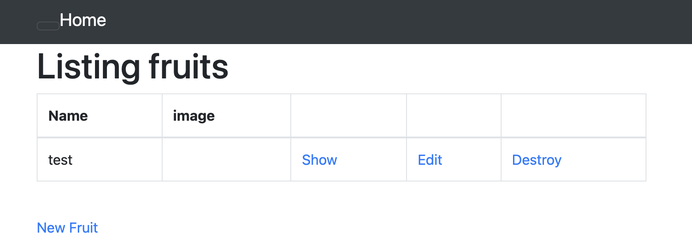

# `第３回課題`
## 課題

### AP サーバーについて調べてみましょう。
- AP サーバーの名前とバージョンを確認してみましょう。
- AP サーバーを終了させた場合、引き続きアクセスできますか?結果を確認して、また AP サーバーを起動してください。

Webサーバーが受け取ったリクエストに応じてデータを取得したり計算するといった処理を実行するサーバー。  
今回のサンプルアプリではPuma version: 5.6.5 (ruby 3.1.2-p20) ("Birdie's Version")が使われているが、PumaはWebサーバーの一種。  
[Control + C]で終了させるとOops になってしまう。再度起動するとWebアプリケーションが起動する。
<br/>
<br/>
<br/>


### DB サーバーについて調べてみましょう。
- サンプルアプリケーションで使った DB サーバー(DB エンジン)の名前と、今 Cloud9 で動作しているバージョンはいくつか確認してみましょう。
- DB サーバーを終了させた場合、引き続きアクセスできますか?

サンプルアプリは『mysql  Ver 8.0.33 for Linux on x86_64 (MySQL Community Server - GPL)』が起動している。  
初期設定では『mysql Ver 15.1 Distrib 10.2.38-MariaDB, for Linux (×86_64) using EditLine wrapper』だったが、このままではセットアップができなかった。  
```sh
mysqladmin -u root -p shutdown
```
を使用するとデータベースを停止できる。
ActiveRecord::ConnectionNotEstablishedと表示される。  
元に戻すときは
```sh
curl -fsSL https://raw.githubusercontent.com/MasatoshiMizumoto/raisetech_documents/main/aws/scripts/mysql_amazon_linux_2.sh | sh
```
を実行する必要がある。
<br/>
<br/>
<br/>


### Rails の構成管理ツールの名前は何でしたか?確認してみてください。　　
bundler  
gemを管理してくれるgem  
```sh
bin/setup
```
を実行した時にUsing bundler 2.3.14 と出てきた。
<br/>
<br/>
<br/>

### 今回の課題から学んだことを報告してください。
#### サーバーとは
クライアントのリクエストに対して、レスポンスを返すコンピュータのこと  
サーバーはWebサーバー・APサーバー・DBサーバーに細分化できる。（Web三層アプリケーション）
#### Webサーバー(プレゼンテーション層)  
HTTP通信でリクエストを受け取り、レスポンスを返す。  
Puma version: 5.6.5 (ruby 3.1.2-p20) ("Birdie's Version")
#### APサーバー（アプリケーション層）
Webサーバーが受け取ったリクエストに応じてデータを取得したり計算するといった処理を実行する。
Puma version: 5.6.5 (ruby 3.1.2-p20) ("Birdie's Version")
#### DBサーバー（データベース層）
Webサービスに必要な情報を保持する。
mysql  Ver 8.0.33 for Linux on x86_64 (MySQL Community Server - GPL)
#### Web三層アプリケーション
メリット
- サーバーにかかる負荷が分散するのでアクセス急増のような障害に強くなる。
- 管理/メンテナンスが容易になる。
- 変更/拡張を行いやすい

デメリット
- たくさんのサーバーコンピュータが必要になるため費用が高くなる。


Puma  
Webサーバーの一種であるが、アプリケーションサーバとして主に動作し、Rackの役割を補助してHTTPリクエストを高速かつ同時処理的に行うことを可能にする。
<br/>
<br/>
<br/>

## 第3回課題の目的
インフラエンジニアに最低限必要なWebアプリケーションの知識を、サンプルのWebアプリケーションを起動（デプロイ）することにより実際に触れながら、仕組み、開発の流れ、主要なコンポーネント（パーツ/部品）について学んでいく。
<br/>
<br/>
<br/>

## 全体の流れ
1. サンプルの入手
2. データベースの設定
- 容量の確保
- 使用するデータベースの変更
- パスワードの変更
- ymlファイルがDBを使えるようにする（？）
3. 環境構築
- rubyのインストール
- yarnのインストール
- ymlファイルがインターネットを使えるようにする（？）
- rails のセットアップ
4. webアプリケーションの起動
- cloud9_dev の権限を変更
- development.rb にURLを渡す
<br/>

## 必要なもの（知識）

- AWSアカウント(課題１)
- Cloud9（課題１）
- GitHub（課題２）
<br/>

## サンプルアプリの入手
実行するコマンド（必須）
```sh
git clone https://github.com/yuta-ushijima/raisetech-live8-sample-app.git
```
Githubから[raisetech-live8-sample-app](https://github.com/yuta-ushijima/raisetech-live8-sample-app)を入手（クローンを作成）する
<br/>
<br/>
<br/>
実行するコマンド（必須）
```sh
cd raisetech-live8-sample-app/
```
raisetech-live8-sample-app/ に移動する
<br/>
<br/>
<br/>

## データベースの設定の手順
### 容量の確保
実行するコマンド
```sh
docker system prune -a
```
実行後はyを押す。  
不要 Docker イメージを削除して空きを作ってくれるらしい

＊別の方法メモ(サイズそのものを増やす)  
サイズの変更  
EC2からインスタンスを停止する  
インスタンスIDをクリック  
ストレージタブをクリック  
ボリュームIDをクリック  

やり方１  
ボリュームIDをクリック  
変更  
サイズ (GiB)10→16  

やり方２  
チェックをいれる  
アクション＞ボリュームの変更  
サイズ (GiB)10→16  
<br/>
<br/>

### データベースをMySQL8.0に変更する
実行するコマンド
```sh
mysql --version
```
使っているデータベースが判る

Maria DBの場合はMySQL8.0に変更する  
<br/>
<br/>
<br/>

実行するコメント（必須）
```sh
curl -fsSL https://raw.githubusercontent.com/MasatoshiMizumoto/raisetech_documents/main/aws/scripts/mysql_amazon_linux_2.sh | sh
```
意味はわからないけど、MySQL8.0に変わる
<br/>
<br/>
<br/>

実行するコマンド
```sh
mysql --version
```
変更できたか調べる。
<br/>
<br/>
<br/>

### データベースのパスワードを変更する
実行するコマンド（必須）
```sh
sudo cat /var/log/mysqld.log | grep "temporary password" | awk '{print $13}'
```
初期パスワードが表示される
<br/>
<br/>
<br/>

実行するコマンド（必須）
```sh
mysql -u root -p
```
mysqlが起動する  
パスワードを求められるので先ほど取得したパスワードをコピペする
<br/>
<br/>
<br/>

実行するコマンド（必須）
```sh
ALTER USER 'root'@'localhost' IDENTIFIED BY '設定するパスワード';
```
設定するパスワードはアルファベットの大文字小文字、特殊文字、数字が入っていないと怒られる
<br/>
<br/>
<br/>

実行するコマンド
```sh
FLUSH PRIVILEGES;
```
やらなくてもパスワードの変更ができるのでコマンドの意味を調べた。よくわからない。  

>FLUSH PRIVILEGESはデータベース内のGRANTテーブルから再読込を実行します。通常、各ユーザ権限とINSTALL PLUGINの情報を、MySQLサーバーはキャッシュに保持しており、この情報を最新化する場合はFLUSH PRIVILEGESを実行する必要があります。CREATE USERやGRANT構文を実行した場合は自動で再読込が実行されるため必要ありませんが、テーブルを直接変更した場合はFLUSH PRIVILEGESを実行する必要があります。[（引用ページ）](https://gihyo.jp/dev/serial/01/mysql-road-construction-news/0080#:~:text=FLUSH%20PRIVILEGES%20%E3%81%AF%E3%83%87%E3%83%BC%E3%82%BF%E3%83%99%E3%83%BC%E3%82%B9%E5%86%85,%E5%AE%9F%E8%A1%8C%E3%81%99%E3%82%8B%E5%BF%85%E8%A6%81%E3%81%8C%E3%81%82%E3%82%8A%E3%81%BE%E3%81%99%E3%80%82)
<br/>
<br/>
<br/>

### mysqlの終了
実行するコマンド（必須）
```sh
quit
```
出来ない時は［Control＋C］を押した後に実行する
<br/>
<br/>
<br/>

### データベースを使えるようにする
実行するコマンド（必須）
```sh
cp config/database.yml.sample config/database.yml
```
Config フォルダの中に database.yml が作成される( database.yml.sample のコピー) 
コピーを作らなくても.sampleを消せばいい。  
どちらかの方法で作った config/database.yml のファイルを開いて編集する   
変更する場所は３箇所  
development とtest のsocket の項目を  
「/tmp/mysql.sock」→「/var/lib/mysql/mysql.sock」に変更

 パスワードの項目に mysql のパスワードを入力

 保存［command + s］を忘れずに行う
<br/>
<br/>
<br/>

## 環境構築の手順
### ruby-3.1.2 をインストール
実行するコマンド
```sh
rvm gemset list
もしくは
ruby -v
```
現在使用しているバージョンが確認できる
<br/>
<br/>
<br/>

実行するコマンド（必須）
```sh
rvm get stable
```
インストールの準備
<br/>
<br/>
<br/>

実行するコマンド（必須）
```sh
rvm install 3.1.2
```
ruby がインストールされる
<br/>
<br/>
<br/>

実行するコマンド
```sh
rvm gemset list
```
ruby-3.1.2 になったか確認
<br/>
<br/>
<br/>

### yarn のインストール
実行するコマンド（必須）
```sh
npm install -g yarn
もしくは
npm install --global yarn
```
yarn のインストール
<br/>
<br/>
<br/>

### rails 環境のセットアップ
実行するコマンド
```sh
rails -v
```
rails のバージョン確認(入っていない)
<br/>
<br/>
<br/>


実行するコマンド（必須）
```sh
bin/setup
```
実行すると赤文字が大量に出てくる。railsアプリに不足しているものを教えてくれている。  
放置していると緑文字が大量に出てくる。多分補ってくれてるんだと思われる。
<br/>
<br/>
<br/>

実行するコマンド
```sh
rails -v
```
rails のバージョン確認  
インストールされていれば成功
<br/>
<br/>
<br/>


## アプリケーションサーバーの起動の手順
実行するコマンド
```sh
bin/cloud9_dev
```
アクセス拒否される
<br/>
<br/>
<br/>

実行するコマンド
```sh
ls -la bin
```
binの中身一覧表示  
オプション  
-a は.ファイルも含めて表示  
-l は詳細表示  
bin/cloud9_dev の権限がどうなっているか確認
<br/>
<br/>
<br/>

実行するコマンド（必須）
```sh
chmod 700 bin/cloud9_dev
```
bin/cloud9_dev の権限を書き換える  
所有者権限			：７  
グループ権限			：０  
その他のユーザー権限	：０
<br/>
<br/>
<br/>

実行するコマンド
```sh
ls -la bin
```
bin/cloud9_dev の権限が変更されたか確認
<br/>
<br/>
<br/>

実行するコマンド（必須）
```sh
bin/cloud9_dev
```
Listening on http://0.0.0.0:8080 で成功（？）

画面上部の preview から preview running application を選択すると  
Blocked host: と書かれた赤いページが表示される。  
スクロールしてconfig.hosts << “URL”　の部分をコピー  

config > environments > development.rb
ファイルを開いて一番下までスクロールする  
Endの上に
config.hosts << “URL”　でコピーしたものをペースト  
保存［command＋S］する

設定ファイルを変えたので一度終了する  
［Control＋C］ で終了できる。
<br/>
<br/>
<br/>

実行するコマンド（必須）
```sh
bin/cloud9_dev
```
右上(Browserの横)をクリックするとページが開く
<br/>
<br/>
<br/>




起動完了
<br/>
<br/>
<br/>


<!--		ここから下はコメントアウト中
## 発生したエラーの原因と解決方法
実行するコマンド
```sh
bin/setup
```
エラー  
bash: bin/setup: No such file or directory  
cd コマンドで移動  

エラー  
Your Ruby version is 2.6.3, but your Gemfile specified 3.1.2  
バージョンが違う。  

エラー  
== Command ["bundle install"] failed ==  
rvm install 3.1.2 を実行  

エラー  
== Command ["bin/yarn"] failed ==  
npm install -g yarn を実行

エラー  
== Command ["bin/rails db:prepare"] failed ==  
データベースにアクセス権限がない。  
- database.yml ファイルにパスワードを入力していないか、そのパスワードが初期パスワード  
- 「/var/lib/mysql/mysql.sock」に変更していない  

解決方法  
データベースの設定手順を参照  
<br/>
<br/>
<br/>

実行するコマンド
```sh
bin/cloud9_dev
```
エラー  
Blocked host: にならず、Oops になる  
解決方法  
safariで実行した場合はChromeで実行する。  
Chromeでは見たことない。


失敗例
rvm install 3.1.2　コマンド

rvm get stableを実行前に実行すると「そんなの知らない。2.6.3ならインストールされている」と怒られる


## その他

```sh
rvm get latest
rvm get head
rm upgrade ruby-2.6.3 ruby-3.1.2
```
yを押していくと途中でエラーが出る。  
そこでnを押してやめれば
```sh
rvm reinstall 3.1.2
```
で解決  
マージしてしまうと修復方法不明。インスタンスを削除して最初からやり直し  
<br/>
<br/>
<br/>

```sh
rvm get latest
```
ルビーのインストール準備に使ってみた  
3.1.2にはなるがbin/setup で
== Command ["bundle install"] failed == になった
```sh
rvm get stable
もしくは
rvm get head
```
を使用して
```sh
rvm reinstall 3.1.2
```
で解決した
<br/>
<br/>
<br/>

```sh
rvm get head
```
だけでやってみた。  
インストールできたのでrvm get stable と代替可能
<br/>
<br/>
<br/>

```sh
rvm list known
```
コマンド
rvm get latest  
rvm get stable  
rvm get head  
の挙動を見るのに使える。  
結局わからない。



## コマンド/用語
```sh
bin/rails db:migrate
```
実行結果：Running via Spring preloader in process ５桁の数字  
環境依存（？）　動画では18050だった。  
マイグレーションファイルを元にデータベースの中にあるテーブル操作を行うコマンドらしい。
<br/>
<br/>
<br/>

マイグレーション  
移行や移動の意味がある
<br/>
<br/>
<br/>

ソケット  
プログラムとインターネットをつなげる接続部分  
ネットワーク通信部分を担当するプログラムファイル
<br/>
<br/>
<br/>


## 動画内で使用されたコマンド
which socket
Socketファイルがどこにあるのか調べるために使用されたと思われる。
whichコマンドは絶対パスを教えてくれるらしいが、場所がわかるファイルで実験しても自分が考えるパスと全く異なっていたため挙動が謎

```sh
ls /var/lib/
```
実行結果は絶対パスでlib内の一覧を表示
libは~の上の上(cdで確認済み)

```sh
ls /var/lib/mysql/
```
このコマンドはアクセス拒否される

```sh
sudo ls /var/lib/mysql/
```
Root権限を持たせるコマンド
上でアクセス拒否されたコマンドを実行できる。


もしかしたらtmp/mysql.sockにコピーか移動すればいいかも（？）
which socketコマンドは.sockファイルを探していたと思われる。
検索しようとしたが、パスが読み取れなかった（？）ため、手動で探した流れ

-->

:::note info
インフォメーション
infoは省略可能です。
:::

:::note warn
警告
○○に注意してください。
:::

:::note alert
より強い警告
○○しないでください。
:::


<details><summary>サンプルコード</summary>

(上に空行が必要)

```rb
puts 'Hello, World'
```
</details>

| Left align | Right align | Center align |
|:-----------|------------:|:------------:|
| This       | This        | This         |
| column     | column      | column       |
| will       | will        | will         |
| be         | be          | be           |
| left       | right       | center       |
| aligned    | aligned     | aligned      |

